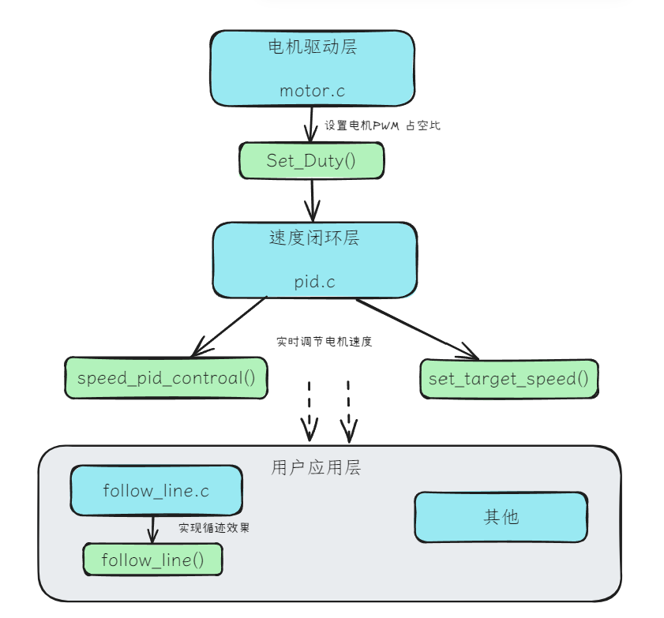

# 简介

本项目为电赛小车的最小系统代码，包含了电机驱动，速度闭环，循迹等功能。其主要特点是各功能模块的分层设计，这让本仓库的的代码有了复用的价值，所以开源。

---

# 分层设计

<p align="center">
  
</p>

如上图逻辑，本仓库将电机驱动和速度闭环与其他模块儿分离开来，抽象出主要功能函数。速度闭环模块儿调用电机驱动实现实时控制速度，其他模块儿亦可调用速度闭环模块实现其他功能。例如，循迹，角度闭环，小车路径规划等等。本仓库只例举出了循迹功能。

---

# 代码架构

<pre lang="markdown"><code> ``` root/ ├── GANWEI/ # 感为无MCU 循迹模块驱动 ├── motor/ # 核心模块 ├── MSPM0/ # 中断与系统时钟 ├── UART/ # 串口通用函数 └── main # 主函数 ``` </code></pre>


---

# 使用说明

这类涉及硬件移植的代码，想要一键运行确实困难。建议直接阅读源码，将电机驱动和速度闭环部分手动移植，最后在这两个模块儿基础上构建自己的用户代码。
